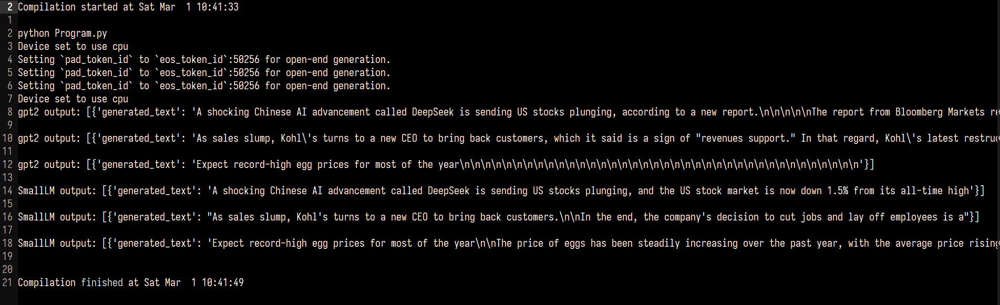

# Introduction

This is the second Project for CS 325 Where we web-scrape 2-3 different websites to get information on a webpage.
This project primarly uses Beautiful Soup as the Python Module to web scrape with.

# Requirements

Download the requirements.yml and install for an environment of your choosing using Venv or Miniconda 

Miniconda:
``` python3
conda env update -n my_env --file requirements.yml
```

or you could use this for Venv or Miniconda after going to the virtual environment you want to use

Venv:
``` python3
pip install -r requirements.yml
```

then to compile go over to the working directory and use the command

```python3
python main.py
```

# Misc / Explanation



