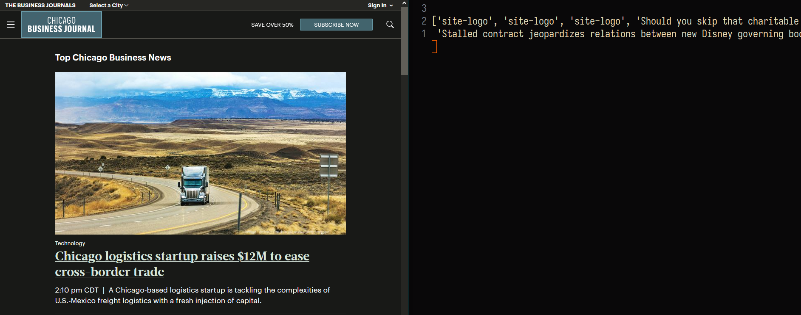

# Introduction

This is the first Project for CS-325, Utilzing two LLM's to read input text from a file and generate a response.

I used Python 3.13.2 and the most up to date version of the Transformers module for Python, for the library that Transformers utilize's I chose Pytorch


# Requirements

Download the requirements.yaml and install for an environment of your choosing using Venv or Miniconda 

Miniconda:
``` python3
conda env update -n my_env --file requirements.yaml
```

or you could use this for Venv or Miniconda after going to the virtual environment you want to use

Venv:
``` python3
pip install -r requirements.yaml
```

then to compile go over to the working directory and use the command

```python3
python Program.py
```

# Misc / Explanation

The two Large Language Models I chose were DistillGpt2 and SmallLM 

The GPT2 Model has around 128 Million Parameters and the SmallLM model is running with the 360 Million Parameters option.

If you're running this on smaller laptops its possible that you might get a memory error, If that is the case then
your computer might not be able to run the model. The GPT2 model should only need <1 GB of RAM
You can go to https://huggingface.co/blog/smollm and choose a smaller model version depending on your hardware.


## compilation output:



